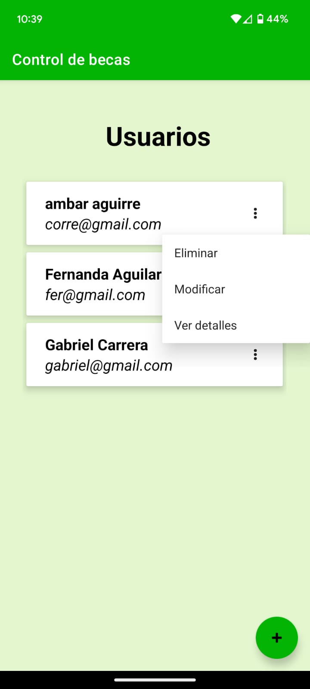

# Gestión de Becarios
Este repositorio proporciona una guía para el desarrollo de una aplicación nativa en Kotlin que facilita la gestión del registro de estudiantes becados. 

## Instrucciones de Acceso

EL ACCESO DEL LOGIN PARA PODER COMENZAR A AGREGAR USUARIOS ES administrador@becas.com password=administrador

## Objetivos

El objetivo del proyecto es desarrollar una aplicación nativa para Android que permita:

- Registrar datos de becarios.
- Agregar nuevos becarios (alta).
- Actualizar la información de becarios existentes (modificación).
- Eliminar registros de becarios (borrar).
- Contar con un sistema de acceso controlado (login) para asegurar la integridad de la información.

## Descripción del Proyecto

La aplicación está enfocada en gestionar el registro y control de becas otorgadas a estudiantes en una escuela o facultad. Sus principales funcionalidades incluyen:

- **Registro de datos clave de becas**, como:
  - Número de cuenta (Dato numérico)
  - Nombre completo (Ejemplo: Juan Antonio Pérez Ruiz)
  - Tipo de beca (Inscripción, Coca Cola, Peña Colorada, Transporte, Alimentos)

- **Funciones principales**:
  - Acceso controlado mediante login.
  - Registro de usuarios.
  - Registro de becarios.
  - Modificación de datos de becarios.
  - Eliminación de registros de becarios.
  - Consulta de becarios mediante un listado.

## Capturas de Pantalla

<strong>Login</strong>

<strong>Pantalla administrador</strong>

<strong>Pantalla usuario</strong>

<strong>Formulario para agregar becarios</strong>

<strong>Pantalla pantalla para agregar usuarios</strong>

